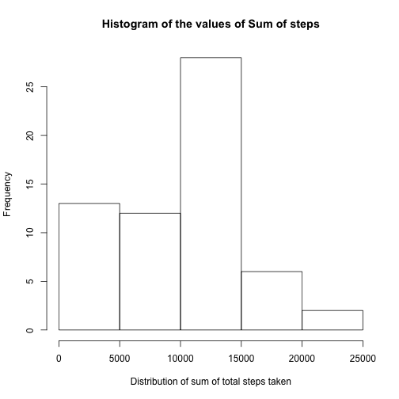
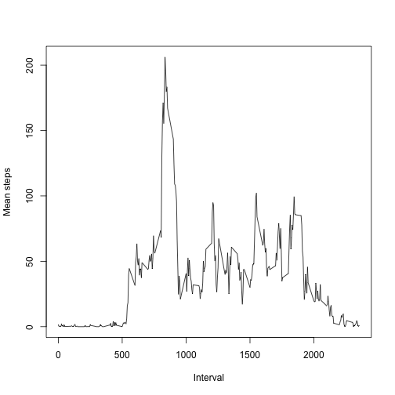
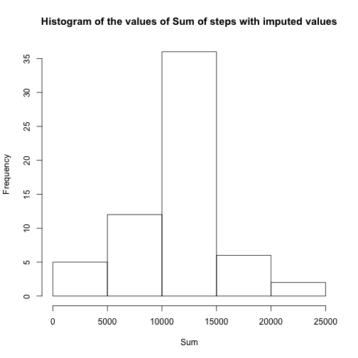
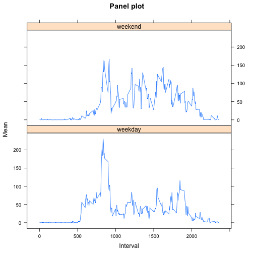

Reproductible Research - Peer Assessment 1
================
Author: Bruno Bandeira de Azevedo
----------------
### Date: February 14, 2015

  We will attempt with this Peer Assessment to answer a few questions regarding data coming from a personal activity monitoring device. This device collects data at 5 minute intervals through out the day. The data consists of two months of data from an anonymous individual collected during the months of October and November, 2012 and include the number of steps taken in 5 minute intervals each day.

Loading the data
----------------

  First step is to load the data files onto R to process. To do this you we used the following commands:


```r
library(RCurl)
unzip("./activity.zip")
data<-read.csv("activity.csv")

## Making the unique days versus sum of steps table
uniqueDays <- unique(data$date)
sumData<-data.frame()
dateData<-data.frame()
for(i in 1:length(uniqueDays)){
  sum = sum(subset(data$steps, data$date==uniqueDays[i]), na.rm=T)
  dateData<-rbind(data.frame(dateData),data.frame(uniqueDays[i]))
  sumData<-rbind(sumData,sum)
}
sumData<-cbind.data.frame(dateData,sumData)
names(sumData)<-c("Date","Sum of steps taken")

# Making the 5 minute interval vs average of steps across days table

uniqueIntervals<-unique(data$interval)
secondDataset<-data.frame()
meanData<-data.frame()
medianData<-data.frame()
for(i in 1:length(uniqueIntervals)){
  mean = mean(subset(data$steps, data$interval==uniqueIntervals[i]), na.rm=T)
  median = median(subset(data$steps, data$interval==uniqueIntervals[i]), na.rm = T)
  meanData<-rbind(meanData,mean)
  medianData<-rbind(medianData,median)
  }
secondDataset<-cbind.data.frame(uniqueIntervals,meanData,medianData)
names(secondDataset)<-c("Interval","Mean","Median")

#Subsetting the max steps in a given interval
maxStepsForInterval <- subset(secondDataset$Interval, secondDataset$Mean==max(secondDataset$Mean))
```


  This will retrieve all files from the server, unzip them and assign them to the data variable.

  For this part we will ignore all the missing values from the data to calculate the mean of steps taken per day.


What is mean total number of steps taken per day?
----------------

### Total number of steps taken per day


```r
sumData
```

```
##          Date Sum of steps taken
## 1  2012-10-01                  0
## 2  2012-10-02                126
## 3  2012-10-03              11352
## 4  2012-10-04              12116
## 5  2012-10-05              13294
## 6  2012-10-06              15420
## 7  2012-10-07              11015
## 8  2012-10-08                  0
## 9  2012-10-09              12811
## 10 2012-10-10               9900
## 11 2012-10-11              10304
## 12 2012-10-12              17382
## 13 2012-10-13              12426
## 14 2012-10-14              15098
## 15 2012-10-15              10139
## 16 2012-10-16              15084
## 17 2012-10-17              13452
## 18 2012-10-18              10056
## 19 2012-10-19              11829
## 20 2012-10-20              10395
## 21 2012-10-21               8821
## 22 2012-10-22              13460
## 23 2012-10-23               8918
## 24 2012-10-24               8355
## 25 2012-10-25               2492
## 26 2012-10-26               6778
## 27 2012-10-27              10119
## 28 2012-10-28              11458
## 29 2012-10-29               5018
## 30 2012-10-30               9819
## 31 2012-10-31              15414
## 32 2012-11-01                  0
## 33 2012-11-02              10600
## 34 2012-11-03              10571
## 35 2012-11-04                  0
## 36 2012-11-05              10439
## 37 2012-11-06               8334
## 38 2012-11-07              12883
## 39 2012-11-08               3219
## 40 2012-11-09                  0
## 41 2012-11-10                  0
## 42 2012-11-11              12608
## 43 2012-11-12              10765
## 44 2012-11-13               7336
## 45 2012-11-14                  0
## 46 2012-11-15                 41
## 47 2012-11-16               5441
## 48 2012-11-17              14339
## 49 2012-11-18              15110
## 50 2012-11-19               8841
## 51 2012-11-20               4472
## 52 2012-11-21              12787
## 53 2012-11-22              20427
## 54 2012-11-23              21194
## 55 2012-11-24              14478
## 56 2012-11-25              11834
## 57 2012-11-26              11162
## 58 2012-11-27              13646
## 59 2012-11-28              10183
## 60 2012-11-29               7047
## 61 2012-11-30                  0
```


### Histogram for the distribution of the Sums


```r
hist(sumData$Sum, xlab="Distribution of sum of total steps taken", main="Histogram of the values of Sum of steps")
```

 


### Mean of the Sums of steps taken per day


```r
mean(sumData$Sum)
```

```
## [1] 9354.23
```


####**Median of the Sums of steps taken per day**


```r
median(sumData$Sum)
```

```
## [1] 10395
```


What is the average daily activity pattern?
----------------


```r
plot(secondDataset$Interval, secondDataset$Mean, type="l", xlab="Interval", ylab="Mean steps")
```

 


  5-minute interval, on average across all the days in the dataset, that contains the maximum number of steps and its value.


```r
maxStepsForInterval
```

```
## [1] 835
```

```r
max(secondDataset$Mean)
```

```
## [1] 206.1698
```


Imputing missing values
----------------

Number of NAs in the data table: 

>(Note: I had a simple check implemented just to see if it is safe to unwrap the value of the number of TRUE values in the table)


```r
if (table(is.na(data[,1])+is.na(data[,2])+is.na(data[,3]))[[1]]!=nrow(data)) {
  table(is.na(data[,1])+is.na(data[,2])+is.na(data[,3]))[[2]]
} else {
    cat("No NA's in the subset") }
```

```
## [1] 2304
```


  I chose to input the missing values for the mean of the interval of 5 minutes extracted from the second data set created previously.


```r
dataNew<-data
for(i in 1:nrow(data)){
  if(is.na(data[i,"steps"])){
    dataNew[i,"steps"]<-subset(secondDataset$Mean, secondDataset$Interval==data[i,"interval"])
  }
}
```


```r
sumData2<-data.frame()
for(i in 1:length(uniqueDays)){
  sum2 = sum(subset(dataNew$steps, dataNew$date==uniqueDays[i]), na.rm=T)
  sumData2<-rbind(sumData2,sum2)
}
sumData2<-cbind.data.frame(dateData,sumData2)
names(sumData2)<-c("Date","Sum of steps taken with imputed values")
```


### Histogram for the distribution of the Sums with Imputed values


```r
hist(sumData2$Sum, xlab="Sum", main="Histogram of the values of Sum of steps with imputed values")
```

 


### Mean of the Sums of steps taken per day with imputed values


```r
mean(sumData2$Sum)
```

```
## [1] 10766.19
```


### Median of the Sums of steps taken per day with imputed values


```r
median(sumData2$Sum)
```

```
## [1] 10766.19
```

  We can verify that the mean was far more centered. This was as expected, since we used the means for the intervals to impute the missing values, and hence, added several values that were centered around the mean into the new data set. The new median was exactly as the mean, since we used all means to impute the new values.


Are there differences in activity patterns between weekdays and weekends?
----------------

  To do this we must first categorize the values between weekdays and weekend days and then do a similar process as the one that evaluated the means for each interval, for each group.


```r
isWeekend <- function(day) {
  switch(day,
         Monday = 0,
         Tuesday = 0,
         Wednesday = 0,
         Thursday = 0,
         Friday = 0,
         Saturday=1,
         Sunday = 1)
}

weekDataset<-dataNew
weekDataset$weekend<-NA
for(i in 1:nrow(dataNew)){
  day<-weekdays(as.Date(dataNew[i,"date"]))
  if(isWeekend(day)){
    weekDataset[i,"weekend"]<-1
  } else {
    weekDataset[i,"weekend"]<-0
  }
}
weekDataset$weekend <- factor(weekDataset$weekend, labels=c("weekday", "weekend"))


uniqueWeekIntervals<-unique(weekDataset$interval)
weekendDataset<-data.frame()
weekdayDataset<-data.frame()
meanDataWeekday<-data.frame()
medianDataWeekday<-data.frame()
meanDataWeekend<-data.frame()
medianDataWeekend<-data.frame()

#Processing the data set and separating between Weekend and Weekdays

for(i in 1:length(uniqueWeekIntervals)){
  subsetIntervalWeekday <- subset(weekDataset$steps, weekDataset$interval==uniqueWeekIntervals[i] & weekDataset$weekend=="weekday")
  
  meanWeekday = mean(subsetIntervalWeekday, na.rm=T)
  medianWeekday = median(subsetIntervalWeekday, na.rm=T)
  meanDataWeekday<-rbind(meanDataWeekday,meanWeekday)
  medianDataWeekday<-rbind(medianDataWeekday,medianWeekday)
  
  subsetIntervalWeekend <- subset(weekDataset$steps, weekDataset$interval==uniqueWeekIntervals[i] & weekDataset$weekend=="weekend")
  meanWeekend = mean(subsetIntervalWeekend, na.rm=T)
  medianWeekend = median(subsetIntervalWeekend, na.rm=T)
  meanDataWeekend<-rbind(meanDataWeekend,meanWeekend)
  medianDataWeekend<-rbind(medianDataWeekend,medianWeekend)
}

#Now we have two different Datasets with Interval values, we are joining them into an alldays Dataset

weekdayDataset<-cbind.data.frame(uniqueWeekIntervals,meanDataWeekday,medianDataWeekday)
weekdayDataset$weekday <- factor("weekday")
names(weekdayDataset)<-c("Interval","Mean","Median", "Weekday")
weekendDataset<-cbind.data.frame(uniqueWeekIntervals,meanDataWeekend,medianDataWeekend)
weekendDataset$weekday <- factor("weekend")
names(weekendDataset)<-c("Interval","Mean","Median", "Weekday")
alldays<-rbind.data.frame(weekdayDataset,weekendDataset)
```


### Panel plot containing a time series plot (i.e. type = "l") of the 5-minute interval (x-axis) and the average number of steps taken, averaged across all weekday days or weekend days (y-axis).

  We can see a slight difference in the middle of the graphic and a higher body at the higher intervals for the weekend (maybe implying people this person works out more during the weekend).


```r
library(lattice)
xyplot(Mean~Interval | Weekday,
       data=alldays,
       main="Panel plot",
       ylab="Mean", xlab="Interval", type="l", layout=c(1,2))
```

 
